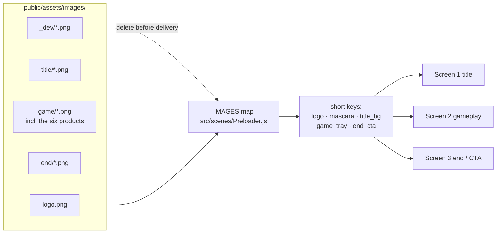

# images/

Every file the playable loads. The Preloader loads them by key from
`window.trackingPath + "images/"`, which resolves to this folder in local dev.

## How it fits together

**In plain English:** the art sits in one folder per screen. `Preloader.js` holds
the single list that turns a filename into a short key, and the scenes only ever
use those keys. So re-exporting a file is a one-line change in that list, and
nothing in the game code has to move.

## Naming rules

| Folder | Key prefix | Holds |
|---|---|---|
| *(root)* | `logo` | the essence wordmark, shared by all three screens |
| `title/` | `title_` | screen 1, the cover |
| `game/` | `game_` | screen 2, the room and the tray |
| `game/` | *the product name* | the six product cut-outs, used on screens 1 and 2 |
| `end/` | `end_` | screen 3, the end card and CTA |
| `_dev/` | `mock_` | flat mocks for eyeballing a screen. **Not for delivery.** |

- Name a file for what the art **is**, never for what the design tool called it
  (`prop-lamp.png`, not `screen-2-drag-assets-object-4.png`).
- Products are named for the product, because that is how the brief, the
  in-game checklist and the client all refer to them. They carry no screen
  prefix, since they appear on both screen 1 and screen 2.
- Product exports are 1000x1000 frames with the product small inside them, so
  their bounding boxes overlap badly. Anything draggable uses a pixel-perfect
  hit area (`makeDraggable()` in `MainMenu.js`) so you pick up what you see.
- A trailing `@2x` means the export is double size and whatever draws it passes
  `{ scale: 0.5 }`. Without the marker, a file is 1:1 with the 681x969 design
  frame.
- Superseded or unused exports go to `assets-archive/` at the repo root, which
  sits outside `public/` so it never ships in the build.

## Before delivery

1. Delete `_dev/` and the `mock_*` block in `Preloader.js` (~2 MB).
2. Delete the "supplied but not currently drawn" block in `Preloader.js`.
3. Compress what is left. Playable ads usually have to ship under a few MB in
   total, and the six product cut-outs alone are over 3 MB right now.
