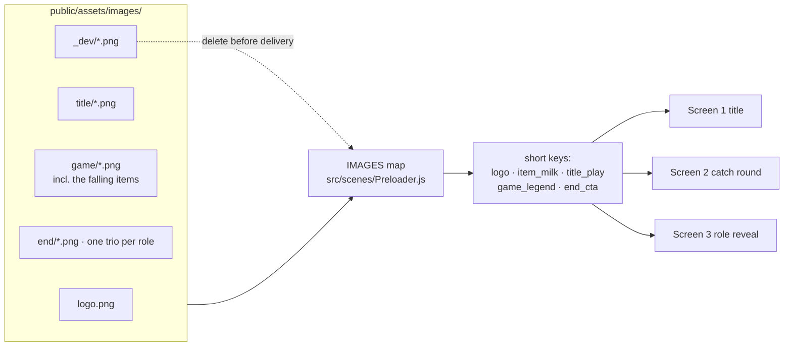

# images/

Every file the playable loads. The Preloader loads them by key from
`window.trackingPath + "images/"`, which resolves to this folder in local dev.

## How it fits together

**In plain English:** the art sits in one folder per screen. `Preloader.js`
holds the single list that turns a filename into a short key, and the scenes
only ever use those keys. Re-exporting a file is a one-line change in that
list; nothing in the game code has to move.

## Naming rules

| Folder | Key prefix | Holds |
|---|---|---|
| *(root)* | `logo` | the Jumbo wordmark, shared by all three screens |
| `game/` | `item_` / `emoji_` | the falling things: milk, smiley bag, box, angry, heart-eyes. They fall on screen 2, decorate screen 1 and icon the screen-3 tally, so no screen prefix |
| `title/` | `title_` | screen 1: headline, subtitle ribbon, three staff mascots, three role labels, SPEEL NU |
| `game/` | `game_` | screen 2: legend bar, score + timer pills, the two basket layers |
| `end/` | `end_` | screen 3: per-role headline / card / tally trio, the winner's mascot, ONTDEK MEER! |
| `_dev/` | `mock_` | half-size flats of sc1–sc3 for eyeballing. **Not for delivery.** |

- Name a file for what the art **is**, never what the design tool called it
  (`item-milk.png`, not `asset-export-7.png`).
- The basket is TWO files (`basket-back.png` the far rim, `basket-front.png`
  the near shell) so a caught item can visibly drop between them.
- The end screen is three files per role, suffixed by the CATEGORIES id in
  `MainMenu.js`: `-store`, `-delivery`, `-warehouse`. Adding a role means one
  code line and three exports.
- There is **no background export**: every mock sits on flat `#EEB717`, painted
  as a rectangle at run time.
- Exports come at mixed resolutions, so nothing trusts native size: scenes fit
  art to a design-space width (`L.fitW`) read off the 1691×2536 mocks.

## Provenance warning

`game/item-*.png` and `game/emoji-*.png` were **cut out of mock sc2.png**
(flat yellow keyed to alpha) because the supplied pack has no item exports.
They're clean at game size, but swap them the moment real cut-outs land —
each is a file replacement, no code change.

`title/mascot-*.png` ARE real client cut-outs (supplied as btn1/2/3mascott,
originals kept in "mocks and assets/assets/"), shared by the title and the
end screen under the unprefixed keys `mascot_*`. One rule they impose: the
**warehouse** cut ends in a straight line across its bottom, so both screens
keep that edge behind opaque UI — the role button on the title, the tally
bar on the ending. Don't move those covers without re-checking it (D-015 in
docs/log/DECISIONS.md). The store and delivery cuts have natural edges. The original essence art this
project was cloned from lives in `assets-archive/` at the repo root, outside
`public/`, so it never ships.

## Before delivery

1. Delete `_dev/` and the `mock_*` block in `Preloader.js` (~1.5 MB).
2. Swap the mock-cut items for real exports if they've arrived.
3. Compress what's left (`basket-front.png` is the heaviest at ~424 KB) and
   run the target network's size gate over the built zip.
